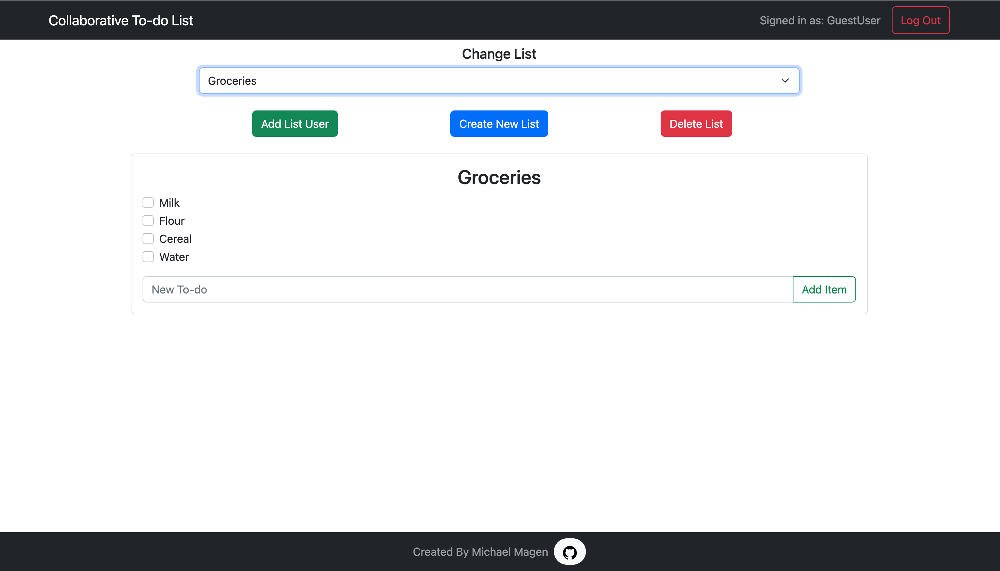
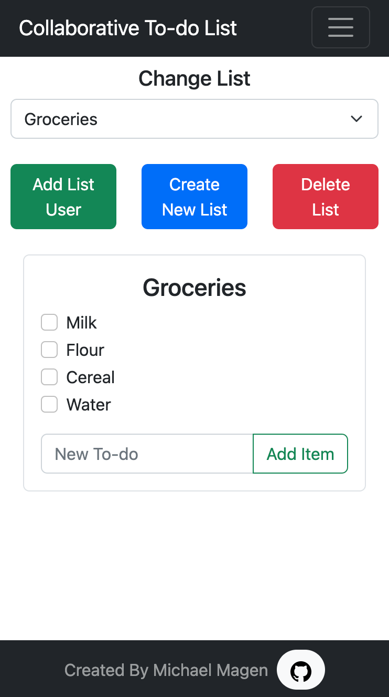

# Collaborative-Todo-List
This is a collaborative to-do list app built with React, Node.js, Express, and MongoDB. 

Live Site: https://collaborative-todo-list.fly.dev/

The backend consists of a custom CRUD API where users, to-do lists, and to-do list items are created, read, updated and deleted into the database.

The frontend is a simple react app that is styled with react boostrap.

# Project Screen Shot

Desktop view: 

Mobile view:

# Author

Michael Magen